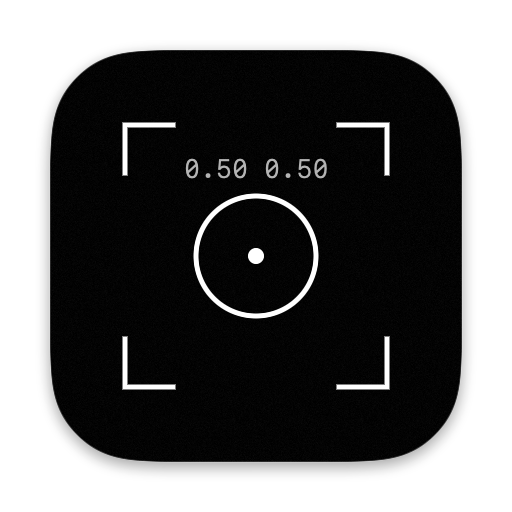

<p align="center">
  
</p>

<h1 align="center"><code>gesture_lens</code></h1>

<p align="center">A macOS camera app you control with your fingertips: no mouse, no keyboard.</p>

<p align="center"><code>[ track ]</code> · <code>[ filter ]</code> · <code>[ snap ]</code></p>

gesture_lens tracks your hands and face through your Mac's camera and draws them in a minimal, terminal-style overlay. Point your index finger at the on-screen sliders and buttons to adjust the image and take photos.

## `> features_`

```text
[hands]     live skeleton of up to two hands, with coordinates for every fingertip
[face]      a box around each detected face
[filters]   brightness · grain · hue · saturation · vignette color
[photos]    3‑2‑1 countdown, saved to ~/Pictures/snap_shots
            (with your filters and, optionally, the tracking overlays)
[sidebar]   live position of every tracked finger and face
[privacy]   everything runs on your Mac, nothing is sent over the network
```

## `> install_`

1. **[Download gesture_lens.dmg](https://github.com/cjrrb/gesture_lens/raw/main/gesture_lens.dmg)**
2. Open the DMG and drag **gesture_lens** into **Applications**.
3. Open **gesture_lens** from your Applications folder.
4. The first time, macOS will say it can't verify the developer, since the app isn't signed with a paid Apple Developer account. Click **Done**, then go to **System Settings → Privacy & Security**, scroll down, and click **Open Anyway** next to the gesture_lens message.
5. Allow camera access when asked.

After the first launch, it opens normally.

> **Requirements:** macOS 14 Sonoma or later, on an Apple silicon or Intel Mac with a camera.

## `> usage_`

Hold a hand up to the camera so its skeleton appears, then use your **index fingertip** as a pointer:

| Control | How |
| --- | --- |
| Sliders | Rest your fingertip on a slider's thumb for a moment to grab it (the thumb fills in), then move your finger to drag it. Move off the slider to let go. |
| Buttons | Rest your fingertip on a button for a moment to tap it. Move away before tapping it again. |

| Button | What it does |
| --- | --- |
| `[ snap ]` | Counts down 3‑2‑1 and takes a photo |
| `[ ] vignette` | Turns the vignette on or off (the slider above it picks the color) |
| `[ ] skeleton` | Shows or hides the hand skeleton. Your fingertip still works as a pointer while it's hidden. |
| `[ ] face` | Shows or hides face tracking |
| `[ reset filters ]` | Puts every filter back to its default |

**Tips:** good, even lighting and a plain background make tracking steadier. Keep your hand a little away from the very edges of the frame.

## `> build_`

Open `gesture_lens.xcodeproj` in Xcode and press **Run** (⌘R).

To rebuild the DMG after making changes, run this from the project folder:

```sh
./dmg/make_dmg.sh
```

It builds a universal Release copy of the app and writes `gesture_lens.dmg` to the top of the project. The first run asks for permission for Terminal to control Finder, which it uses to lay out the DMG window.

The app icon and the DMG background are drawn in code: see `icon/render_icon.swift` and `dmg/render_background.swift`.

---

<p align="center"><code>> end_</code></p>
